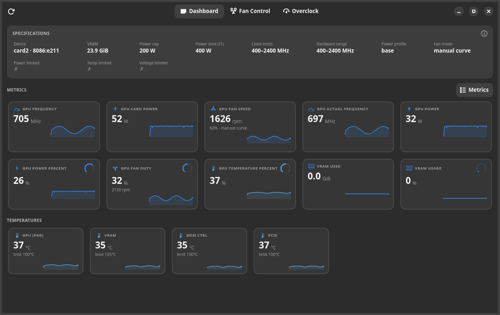
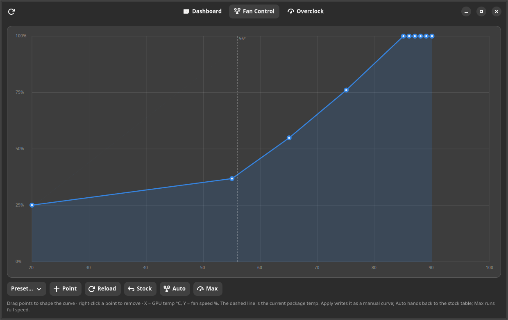
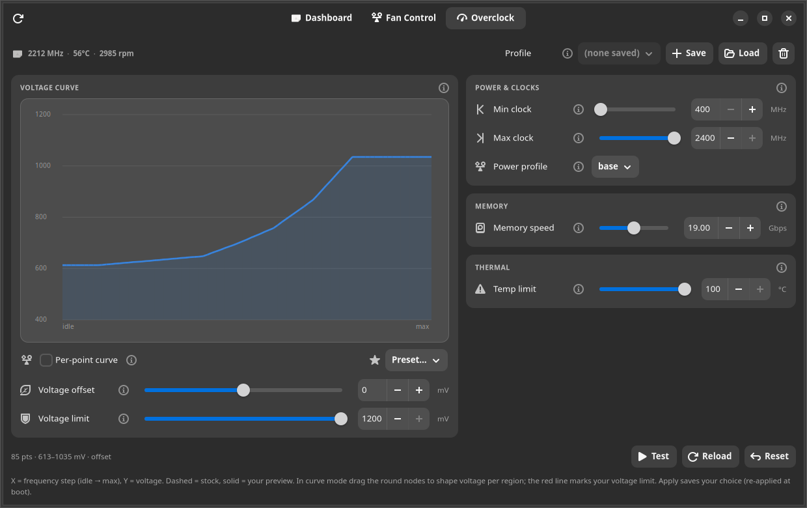

# Intel Arc **Pro** Battlemage — Linux fan control, GPU tuning & overclocking

A complete Linux control panel for the **Intel Arc Pro B60 / B70** (Battlemage) — **custom fan
curves**, **power/clock tuning**, **voltage-frequency-curve overclocking**, a live **metrics
dashboard**, a **fan-guarded stability test**, **multi-GPU** support, and **kernel-update
resilience** — where the stock `xe` driver exposes only read-only fan RPM and no voltage control.
Everything is driven from a native **GTK4 desktop app** (`xe-gpu-gui`) *and* scriptable CLI helpers.

> **Overclocking now works too.** The VF (voltage-frequency) curve — the one control Windows has
> and stock `xe` lacks — is unlocked by a small `xe_gt_oc` patch that issues the PCODE *begin →
> write → end* transaction the stock driver omits. Read/undervolt/overvolt the 85-point curve from
> sysfs. It was never a fused-off Pro-SKU lock — just a missing driver transaction. See
> **[docs/OVERCLOCKING.md](docs/OVERCLOCKING.md)**.

> **Key finding:** the Arc **Pro** B60 (`8086:e211`) does **not** need the missing MEI late-bind
> fan firmware for *manual* control. Intel's fan-control patch (series 168027) programs the user
> fan table straight over the `FAN_SPEED_CONTROL` PCODE mailbox, and the Pro card's PCODE accepts
> it directly. Confirmed working end-to-end on a real B60 — see [docs/EVIDENCE.md](docs/EVIDENCE.md).

Related upstream issue: [intel/compute-runtime #885](https://github.com/intel/compute-runtime/issues/885).



## What works (verified on Arc Pro B60, `8086:e211`, kernel 7.0.0 / Ubuntu 26.04)

| Capability | Stock `xe` | With this toolkit |
|---|---|---|
| Read fan RPM / temps | ✅ | ✅ |
| Write fan speed (`pwm1`) | ❌ | ✅ |
| 10-point fan curve (`pwm1_auto_point*`) | ❌ | ✅ |
| Graphical fan-curve editor | — | ✅ built-in (`xe-gpu-gui`, draggable points) |
| GPU power cap (TDP) | ✅ sysfs | ✅ + persistent helper |
| GPU clock min/max limits | ✅ sysfs | ✅ + persistent helper |
| **Voltage-frequency curve (undervolt/overclock)** | ❌ | ✅ `xe_gt_oc` patch + `xe-gpu oc` |
| **VRAM (GDDR6) memory-speed overclock** | ❌ | ✅ `xe_gt_oc` patch (`oc/mem_speed`) + `xe-gpu oc mem` |
| **GPU temperature (throttle) limit** | ❌ (read-only) | ✅ `xe_gt_oc` patch (`oc/temp_limit`) + `xe-gpu oc temp` |
| Idle power/heat optimization | ❌ (idles at 1200 MHz) | ✅ (idles at 400 MHz) |
| All-sensor temp/health monitor | raw sysfs | ✅ `xe-gpu-temps` (table/watch/json) |
| Single-command status dashboard | — | ✅ `xe-gpu` (fan+clocks+power+temps) |
| Native desktop GUI | — | ✅ `xe-gpu-gui` (GTK4: animated metric dashboard, fan-curve editor, VF-curve overclock tab, stability test) |
| Live VRAM-usage metric | ⚠️ per-client only (`fdinfo`); device-total needs root `debugfs` | ✅ `xe-gpu-vram.service` → device-total GUI tile, no root |
| Overclock benchmarking | — | ✅ FPS, VRAM bandwidth, compute (TFLOPS) + **real LLM tokens/sec** (OpenVINO GenAI), compared to a saved **stock baseline** |
| Silent-corruption guard | — | ✅ LLM-output **coherence check** flags an unstable memory OC that keeps tok/s high but produces gibberish |
| No repeat password prompts | — | ✅ optional polkit rule — the GPU-control helpers run without a prompt for a local admin |
| Multiple GPUs | — | ✅ per-card selector; all tabs + writes re-target the chosen card; stock baseline + benchmarks keyed per-card |
| Survives reboots | — | ✅ systemd + failed-boot watchdog (a bad OC can't cause a boot loop) |
| Survives kernel updates | — | ✅ auto-rebuild hook |

## Desktop app — `xe-gpu-gui`

A native **GTK4 / libadwaita** control panel (`xe-gpu-gui`, or "Arc GPU Dashboard" in your apps
menu). Three tabs; all writes go through `pkexec`. `install.sh` also drops in a scoped **polkit
rule** so those helpers run **without a password prompt** for a locally logged-in admin (delete
`/etc/polkit-1/rules.d/49-xe-gpu.rules` to go back to per-action prompts). Full walkthrough in
**[docs/GUI.md](docs/GUI.md)**.

| Fan Control | Overclock |
|---|---|
|  |  |

- **Dashboard** — a live (2 s) monitor:
  - **Specifications** row — fixed values: device, VRAM size, power cap, power limit, clock limits,
    hardware range, power profile, fan mode, and Power/Temp/Voltage-**limited** ✓/✗ indicators.
  - **Metrics** — animated tiles with a custom icon (gauge / bolt / fan / RAM chip / thermometer), a
    value that **tweens** to each reading, a scrolling **sparkline**, and a **radial ring** for the
    percentage metrics. Covers GPU frequency (+actual), **card & GPU power draw** (derived from the
    energy counters), power %, fan speed & duty, temperature %, and **VRAM used / usage**.
  - **Temperatures** — every sensor (GPU / VRAM / Mem-ctrl / PCIe + all VRAM channels) with its own
    sparkline; the number + line turn **red** near the crit limit, 🔥 on the hottest.
  - **Metrics filter** — a modal to show/hide any metric or sensor; the choice is saved across launches.
  - **GPU selector** — on a multi-GPU box, a header dropdown picks which card everything targets.
- **Fan Control** — a draggable graphical fan-curve editor (10-point, presets, live temp marker) plus
  **Auto** (stock table) and **Max** buttons.
- **Overclock** *(needs the `xe_gt_oc` patch)* — a VF-curve editor in two modes (uniform **offset** or
  per-point **drag-the-nodes curve**), with aligned slider+spinbox controls for voltage offset,
  voltage limit, power, memory speed and temp limit; a colour-zoned curve graph; **preset profiles**
  (Stock / Efficient / Balanced / Performance); **save/load your own named profiles**; and a
  **Stability test** that runs a GPU load with the fan ramped to max and **auto-reverts** if the card
  hangs.
  - **Benchmark (opt-in)** — the test can also measure FPS, VRAM bandwidth, compute (TFLOPS) and
    **real LLM tokens/sec** (prefill + decode, via OpenVINO GenAI on the GPU), then show a
    **table comparing this run to your saved stock baseline** (▲/▼ per metric). A **Stock bench**
    button records that baseline; the app offers to run one if you benchmark an OC without it.
    A **coherence check** on the LLM output catches an unstable *memory* overclock that keeps
    tok/s high but silently corrupts results — treated as a failure and reverted.
  - Stock defaults, the stock baseline, and every benchmark are **keyed per-card**, so the tool
    works across different GPUs (it reads each card's own stock values instead of assuming the B60's).

## How it works

- **Fan control** is Intel's kernel patch **series 168027** (`drm/xe/hwmon`, by Karthik Poosa) —
  not yet in mainline. This repo bundles the CachyOS-7.1.2-adapted patch (which also applies to
  Ubuntu 7.0.0 with fuzz) plus automation to build it as an out-of-tree `xe.ko`, and userland
  helpers on top. Fan curve = `FAN_SPEED_CONTROL` PCODE: per-point `FSC_WRITE_FAN_TABLE` (0x1) with
  `temp | speed<<8`, then `FSC_WRITE_NUM_FAN_CONTROL_POINTS` (0x0) to commit; `pwm1_enable` selects
  full-speed(0)/manual(1)/auto-stock(2).
- **Power/clock tuning** uses only driver-exposed sysfs (`.../gt0/freq0/*`, hwmon `power1_cap`) —
  no patch, no PCODE poking, safe.
- **Overclocking (VF curve)** is a separate, self-contained `xe_gt_oc` patch (`kernel/` +
  `scripts/apply_xeoc.sh`) that adds `.../gt0/oc/vf_curve`. Writing the curve is a PCODE
  transaction (`begin` `0x5f/2` → 85× point write `0x5d/0xa` → `end` `0x5d/0xb`); the stock
  driver omits the `begin`, so the writes are rejected. Details + how it was derived:
  [docs/OVERCLOCKING.md](docs/OVERCLOCKING.md).

## Quick start (Ubuntu / Debian-ish)

```bash
# 1. build & install the patched xe module for your running kernel
#    (verified recipe — uses the kernel's real config + correct vermagic so the
#     module BINDS; full detail in docs/LINUX-BUILD.md, DKMS auto-rebuild-on-
#     kernel-update in dkms/README.md)
sudo bash scripts/build-xe-module.sh --build-only   # optional: build + verify only
sudo bash scripts/build-xe-module.sh && sudo reboot # build, install, reboot to activate

# 2. install the userland helpers + GUI (one command; re-run after every `git pull`)
sudo bash install.sh
# ...or install pieces individually:
sudo install -m755 scripts/xe-fan-curve.sh  /usr/local/bin/xe-fan-curve
sudo install -m755 scripts/xe-gpu-tune.sh   /usr/local/bin/xe-gpu-tune
sudo install -m755 scripts/xe-gpu-temps.sh  /usr/local/bin/xe-gpu-temps
sudo install -m755 scripts/xe-gpu.sh        /usr/local/bin/xe-gpu
sudo install -m755 scripts/xe-gpu-oc.sh     /usr/local/bin/xe-gpu-oc      # overclocking CLI
sudo install -m755 scripts/xe-fan-rebuild.sh /usr/local/sbin/xe-fan-rebuild

# optional: unlock voltage-frequency-curve overclocking (adds .../gt0/oc/vf_curve)
sudo bash scripts/apply_xeoc.sh && sudo reboot   # see docs/OVERCLOCKING.md
sudo install -m755 kernel-hook/zz-xe-fan-rebuild /etc/kernel/postinst.d/zz-xe-fan-rebuild
sudo cp systemd/etc/*.conf /etc/
sudo cp systemd/*.service /etc/systemd/system/
sudo systemctl daemon-reload
sudo systemctl enable --now xe-fan-curve.service xe-gpu-tune.service
# if you installed the OC patch (below), also persist the voltage curve across reboots:
sudo systemctl enable --now xe-gpu-oc.service
```

Full step-by-step (with the module install/reload, `.zst` gotcha, and verification):
**[docs/INSTALL.md](docs/INSTALL.md)**.

## Usage

```bash
# native desktop GUI (GTK4/libadwaita): live dashboard + graphical fan-curve editor
xe-gpu-gui             # or launch "Arc GPU Dashboard" from your apps menu

# one-stop dashboard + front-end (wraps the tools below)
xe-gpu                 # status: card + clocks + power + fan + temps in one view
xe-gpu watch           # live dashboard
xe-gpu fan set 45:80 55:130 65:180 75:220 85:255   # -> xe-fan-curve
xe-gpu tune set --power-w 150                        # -> xe-gpu-tune
xe-gpu temps                                         # -> xe-gpu-temps

# fan
sudo xe-fan-curve show
sudo xe-fan-curve set 45:80 55:130 65:180 75:220 85:255   # temp°C : pwm(0-255)
sudo xe-fan-curve auto        # hand back to stock auto table
sudo xe-fan-curve max         # full speed

# power / clocks
sudo xe-gpu-tune show
sudo xe-gpu-tune set --power-w 150 --clk-max 2000 --clk-min 400
sudo xe-gpu-tune reset

# overclocking — voltage/memory/temp (needs the xe_gt_oc patch, see docs/OVERCLOCKING.md)
sudo xe-gpu-oc read             # dump the 85-point curve + memory speed + temp limit
sudo xe-gpu-oc offset -25       # undervolt every point 25 mV (cooler / more efficient)
sudo xe-gpu-oc offset 25 1050   # overvolt +25 mV, capped at a 1050 mV ceiling
sudo xe-gpu-oc curve 0:820 10:880 ...   # write a full/partial custom curve (one transaction)
sudo xe-gpu-oc mem 20000        # GDDR6 memory speed, Mbps (20000 = 20 Gbps)
sudo xe-gpu-oc temp 95          # GPU thermal-throttle target, °C
sudo xe-gpu-oc profile save daily   # save current voltage/memory/temp as a named profile
sudo xe-gpu-oc profile load daily   # re-apply it (also: profile list / delete)
sudo xe-gpu-oc reset            # restore stock curve + memory + temp

# temperatures / health (read-only, no patch needed)
xe-gpu-temps            # table of every sensor + limits, fan, power
xe-gpu-temps watch 2    # live refresh every 2s
xe-gpu-temps json       # machine-readable (for scripts / dashboards)
```

Overclocks reset to stock on cold boot; choices persist to `/etc/xe-gpu-oc.conf` and are re-applied
by `xe-gpu-oc.service`. On a multi-GPU box, set `ARC_GPU_BDF=<pci-address>` to target a specific card
(the GUI does this automatically). VRAM usage needs `xe-gpu-vram.service` (installed + enabled by
`install.sh`).

- GUI fan curves via the **built-in editor** (`xe-gpu-gui`) — see [docs/GUI.md](docs/GUI.md).
- GPU tuning details — see [docs/GPU-TUNING.md](docs/GPU-TUNING.md).
- Persistent config: `/etc/xe-fan-curve.conf`, `/etc/xe-gpu-tune.conf`.

## The full story
**[docs/NOTES.md](docs/NOTES.md)** — the project journal: how fan control and overclocking were
reverse-engineered (DTrace on the live Windows driver → the missing PCODE `0x5f/2` begin
transaction), every hardware fact learned (VF-curve monotonicity, the Vmax rail, the firmware VR
lock, what telemetry Linux does/doesn't expose), the dead ends, and the traps.

## Windows

A **Windows port** lives under **[windows/](windows/)**. It provides the same fan curves,
power/temperature limits, VF-curve overclocking, live telemetry, and a boot service — but built on
Intel's **Graphics Control Library (IGCL / ControlLib.dll)** instead of the Linux `xe` sysfs + PCODE
patches, so there's **no kernel driver to sign**. It ships an `arc-gpu` CLI and an `arc-fan-service`
Windows service. See **[windows/README.md](windows/README.md)** to build/use it and
**[windows/PORT.md](windows/PORT.md)** for the Linux→Windows capability map and roadmap.

## Kernel updates

The patched `xe.ko` is replaced by the stock driver on a kernel update. The included
`/etc/kernel/postinst.d/zz-xe-fan-rebuild` hook (calling `xe-fan-rebuild`) rebuilds it
automatically **when the matching `linux-source` is installed**. Major kernel jumps may need
`apt install linux-source-<newver>` and a patch re-fuzz. (True DKMS is not possible — `xe` can't
build against headers-only; it needs the full kernel source + i915 siblings.)

## Contributing upstream

The real fix is series 168027 landing in mainline. The highest-impact thing you can do is add a
**`Tested-by`** for your card to that series on `intel-xe@lists.freedesktop.org`, and confirm on
compute-runtime #885. Templates + full workflow: [contrib/](contrib/).

## Credits & license

- **Fan-control kernel patch**: Intel — series 168027, *Karthik Poosa* (`intel-xe@lists.freedesktop.org`). GPL-2.0. Bundled here under `patch/` with its kernel lineage intact.
- **B580 groundwork + CachyOS patch adaptation**: [PerkyZZ999/XeDriver_FanPatch](https://github.com/PerkyZZ999/XeDriver_FanPatch).
- **This repo's automation, helpers, tuning, and Pro-card (B60/B70) enablement**: see LICENSE (MIT for the scripts). The bundled kernel patch remains GPL-2.0.

*Not affiliated with or endorsed by Intel. Use at your own risk — see [docs/EVIDENCE.md](docs/EVIDENCE.md) for exactly what was tested.*
